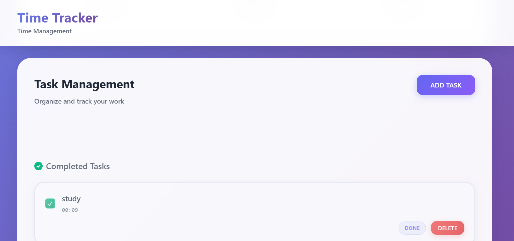
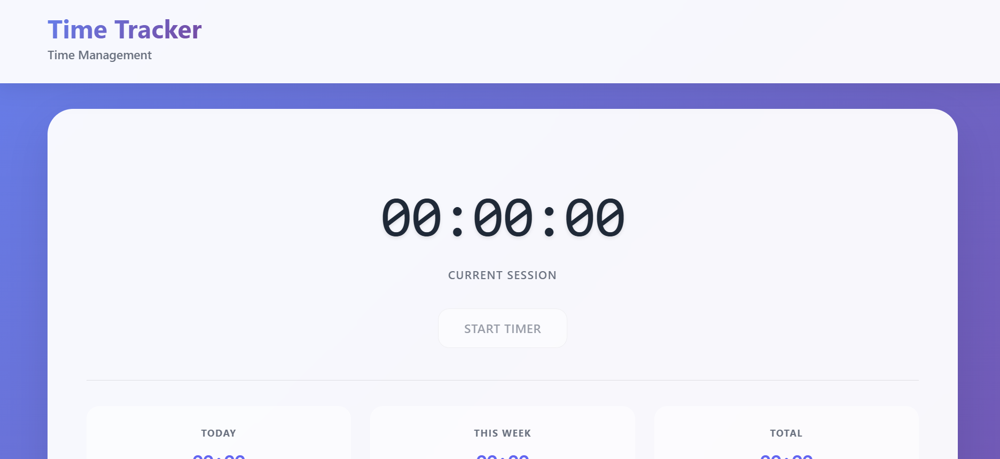
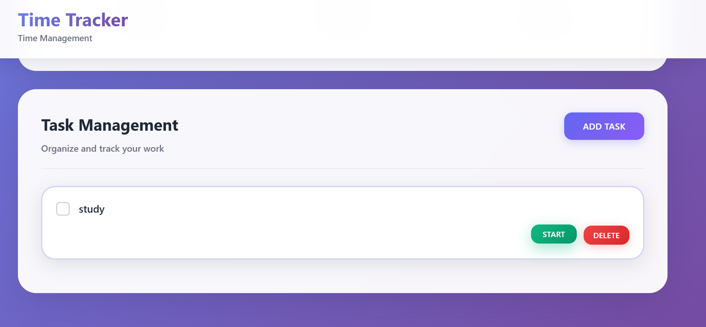
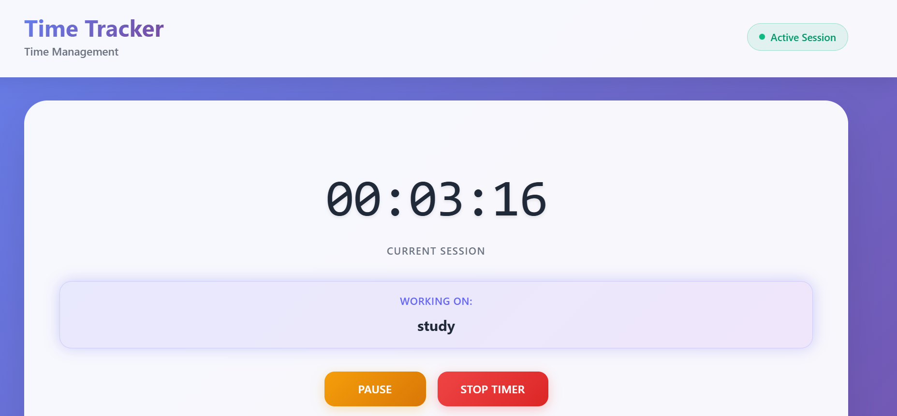

# 🚀 Time Tracker Pro: An AI-Powered Productivity Hub

**Time Tracker Pro** is a sophisticated, feature-rich time management application designed for professionals who want to optimize their workflow. Built with **React** and supercharged with a **Gemini-powered AI Coach**, this app goes beyond simple time tracking to provide deep, actionable insights into your work habits.

---

## ✨ Unmatched Features

This application is packed with advanced features designed to provide a seamless and insightful productivity experience.

### Core Tracking & Workflow
- ✅ **Dual-Mode Timer**: Effortlessly switch between a high-precision **Stopwatch** for task-based timing and a fully customizable **Pomodoro Timer** for focused work sessions.
- 🍅 **Advanced Pomodoro Settings**: Tailor your workflow with customizable durations, auto-starting sessions, sound alerts, and desktop notifications.
- ⚙️ **Persistent State**: All tasks and settings are saved in the browser's local storage, ensuring your data is always there when you return.

### Analytics & Intelligent Insights
- 🤖 **AI Productivity Coach**: Leverage the power of **Google's Gemini** to ask natural language questions about your data and receive personalized advice to improve your focus and efficiency.
- 📊 **Interactive Dashboard**: Visualize your productivity with a clean dashboard, including a doughnut chart showing time distribution across your top tasks.
- 🔥 **Productivity Heatmap**: A GitHub-style activity calendar provides an at-a-glance overview of your most productive days and helps you build consistent work habits.

### Professional Tools & Exporting
- 📄 **Professional PDF Reports**: Generate and download beautifully formatted PDF summaries of your tasks, complete with summary statistics and a detailed table—perfect for client reports or personal archiving.
- 📈 **CSV Export**: Easily export all your task data to CSV for use in spreadsheets or other data analysis tools.

---

## 🛠️ Tech Stack

- **Frontend**: React, Vite
- **Styling**: Custom CSS with a focus on modern, responsive design
- **AI Integration**: Google Gemini API
- **Data Visualization**: Chart.js, React Activity Calendar
- **PDF Generation**: jsPDF, jspdf-autotable

---

## 📸 Screenshots

*New screenshots showcasing the AI Coach, Pomodoro Timer, and advanced dashboard are needed to reflect the latest features.*

> Located in `/assets` folder
> 
> 
> 
> 

---

## 📂 Getting Started

### 1. Clone the repo
```bash
git clone [https://github.com/AkshatChauhan7/stop-watch.git](https://github.com/AkshatChauhan7/stop-watch.git)

2. Install dependencies
npm install

3. Set up Environment Variables
Create a .env file in the root of the project and add your Gemini API key:

VITE_GEMINI_API_KEY="YOUR_API_KEY_HERE"

4. Run the development server
npm run dev
